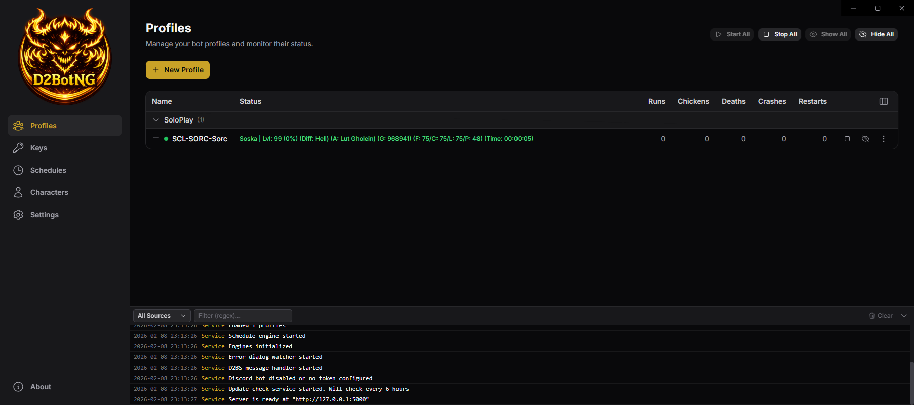
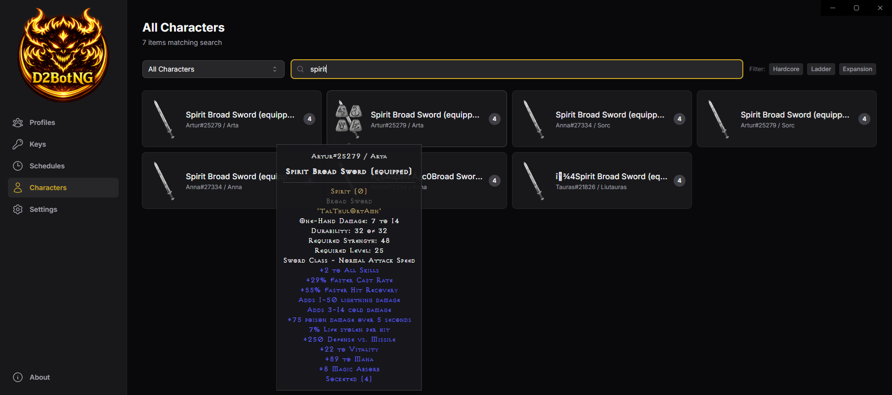

# D2BotNG

> Mostly vibe-coded with Claude.

A modern rewrite of D2Bot - a Diablo II bot manager. Built with .NET 10 and React, hopes to provide full D2BS compatibility with a clean web-based interface.

## Screenshots





## Getting Started

Download the latest release from the [Releases](../../releases) page. Two versions are available:

| Version | Size | Requirements |
|---------|------|-------------|
| **Self-contained** | Larger | Windows 10/11 (x86) — just run, no prerequisites |
| **Framework-dependent** | Smaller | Windows 10/11 (x86) + [.NET 10 Runtime](https://dotnet.microsoft.com/download/dotnet/10.0) |

To get started:

1. Download the `.exe` for your preferred version
2. Place it in a directory of your choice and run it — the web UI opens automatically in a desktop window
3. Configure your Diablo II path and base path in **Settings**
4. Add profiles and start botting

The web UI is also available at `http://localhost:5000` from any browser.

For headless/server use (no GUI window), run with `--headless`. See [Command Line](#command-line) for all options.

## Configuration

App settings are stored in `d2botng.json` next to the exe (server, Discord, display, game config, base path).

Bot data files are stored under the **base path** in `data/ng/` (protobuf JSON format). The base path defaults to the exe directory but can be changed in Settings:

| File | Purpose |
|------|---------|
| `<base path>/data/ng/profiles.json` | Bot profiles |
| `<base path>/data/ng/keylists.json` | CD key lists |
| `<base path>/data/ng/schedules.json` | Schedule configs |
| `<base path>/data/ng/patches.json` | Memory patches (version-specific) |

### Migration from Legacy Format

Legacy D2Bot data files (JSONL format in `data/`) are automatically migrated to `data/ng/` on first startup. Migration also runs when the base path is changed from the Settings page.

- **Non-destructive** - Original `data/` files are left intact
- **Per-file** - Each file is migrated independently; existing files in `data/ng/` are skipped. Delete a specific file to re-migrate it
- **IRC profiles dropped** - Legacy IRC-type profiles are not migrated
- **Settings not migrated** - Settings did not exist in the legacy format; `settings.json` is created fresh
- **Format change** - Legacy JSONL (one JSON object per line) is converted to protobuf JSON (single document with typed wrapper messages)

No manual steps are required. To force re-migration of a specific file, delete it from `data/ng/` and restart.

## Features

- **Web UI** - React frontend with Tailwind CSS, dark Diablo-inspired theme
- **Remote Access** - Password-protected web interface accessible from anywhere
- **Real-time Updates** - gRPC streaming for live profile status, console output, item drops
- **Item Rendering** - DC6 sprite rendering with proper D2 color palettes and socket overlays
- **Discord Integration** - Slash commands for remote control (/list, /start, /stop, /restart, /mule, /schedule)
- **Key Management** - Visual dashboard with round-robin rotation, usage tracking, hold/release
- **Scheduling** - Automated profile scheduling with time-based rules (supports overnight ranges)
- **Drag & Drop** - Reorder profiles with drag-and-drop
- **Dual Mode** - GUI (WebView2 desktop app) or headless server
- **Console** - Real-time console output with source filtering, regex search, D2 color codes

### Remote Access

Edit `d2botng.json` or use the Settings page in the UI:

```json
{
  "server": {
    "host": "0.0.0.0",
    "port": 5000,
    "password": "your-secret"
  }
}
```

When a password is set, the web UI will prompt for it on connection.

### Discord Bot

```json
{
  "discord": {
    "enabled": true,
    "token": "your-bot-token",
    "serverId": "123456789"
  }
}
```

Use the **Test Discord** button in the Settings page to verify your configuration.

#### Discord Slash Commands

| Command | Description |
|---------|------------|
| `/list` | List all profiles with status |
| `/status <profile\|all>` | Detailed profile status with stats |
| `/start <profile\|all>` | Start profile(s) |
| `/stop <profile\|all>` | Stop profile(s) |
| `/restart <profile\|all>` | Restart profile(s) |
| `/mule <profile\|all>` | Trigger mule run |
| `/schedule <enable\|disable> <profile\|all>` | Control scheduling |
| `/identify <password>` | Authenticate for privileged commands |

Privileged commands (start, stop, restart, mule, schedule) require `/identify` first when a server password is set.

## Command Line

```
D2BotNG.exe [options]

--headless    Run as server only (no GUI window)
--dev-ui      Proxy UI requests to Vite dev server
```

## D2BS Compatibility

Full compatibility with D2BS:

- Same command-line arguments (`-d2c`, `-d2x`, `-handle`, `-profile`)
- WM_COPYDATA IPC messaging
- DLL injection (LoadLibraryA remote thread)
- Memory patches for various D2 versions
- d2bs.ini generation with game paths and CD keys
- All D2BS message types supported (heartbeat, status, console, items, key rotation, etc.)

## Development

### Requirements

- Windows 10/11 (x86 build for D2BS compatibility)
- .NET 10 SDK
- Node.js 20+

### Quick Start

```bash
# Build frontend
cd src/D2BotNG.UI
npm install
npm run build

# Build and run backend
cd ../D2BotNG
dotnet run
```

The web UI will be available at `http://localhost:5000`.

### Dev Server

```bash
# Terminal 1 - Vite dev server with hot reload
cd src/D2BotNG.UI
npm run dev

# Terminal 2 - Backend with UI proxy
cd src/D2BotNG
dotnet run -- --dev-ui
```

The Vite dev server runs on port 4200, and the backend proxies UI requests to it in `--dev-ui` mode.

### Building

Build produces a single `D2BotNG.exe` with the UI and all game assets embedded.

```bash
cd src/D2BotNG

# Self-contained — bundles .NET runtime, no prerequisites on target machine
dotnet publish -c Release --self-contained

# Framework-dependent — smaller exe, requires .NET 10 runtime installed
dotnet publish -c Release --no-self-contained
```

Output: `bin/Release/net10.0-windows/win-x86/publish/D2BotNG.exe`

### Architecture

```
protos/              # Protobuf service definitions (source of truth)
src/
  D2BotNG/           # .NET 10 backend
    Services/        # gRPC service implementations
    Engine/          # Profile lifecycle, scheduling
    Windows/         # Win32 interop, DLL injection, IPC
    Data/            # Protobuf JSON persistence (data/ng/)
    Rendering/       # DC6 sprite decoding
    Controllers/     # REST endpoints (item images)
    UI/              # WinForms + WebView2 host
  D2BotNG.UI/        # React 18 frontend
    src/
      features/      # Page components per feature
      components/    # UI component library + layout
      stores/        # Zustand state stores
      hooks/         # React Query mutations
      lib/           # gRPC client, auth, rendering
      generated/     # Protobuf-generated TypeScript types
Resources/           # DC6 sprites, palettes, fonts
```

### Tech Stack

| Layer | Technology |
|-------|-----------|
| Backend | .NET 10, C# 13, ASP.NET Core, gRPC, Serilog |
| Frontend | React 18, TypeScript, Vite 6, Tailwind CSS |
| State | Zustand (real-time events), TanStack React Query (mutations) |
| Communication | gRPC-Web via Connect-RPC |
| Desktop | WebView2, WinForms, system tray |
| Windows | P/Invoke, WM_COPYDATA IPC |

### How It Works

The backend manages Diablo II game processes through Win32 APIs:

1. **Launch** - Creates a suspended game process, applies memory patches, resumes, injects D2BS.dll
2. **Communicate** - D2BS scripts send messages back via WM_COPYDATA (JSON payloads)
3. **Monitor** - Heartbeat tracking detects hung processes, crash recovery auto-restarts
4. **Stream** - All state changes broadcast to connected web clients via a single gRPC server-stream

The frontend connects to a single `StreamEvents` gRPC call and receives all updates in real-time. Mutations (create, update, delete) return empty responses - the UI updates arrive through the event stream.

## License

See LICENSE file.
